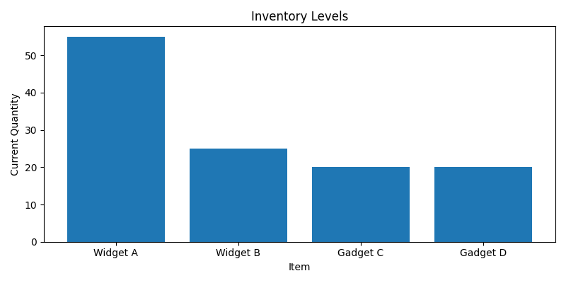

# Internal Process Automation (Mock Version)

This repository demonstrates a **mock inventory tracking system** with QR-style check-in/check-out, automatic logging, and inventory visualization.
It is designed as a **portfolio-ready project**, inspired by real inventory workflows but using **dummy data only**.

The project showcases Python programming, data handling with **pandas**, visualization with **matplotlib**, and **modular, class-based design**.

---

## Features

- Inventory tracking and updates with a CSV database
- Check-in/check-out workflow simulating QR scanning
- Input validation for:
  - Only existing numeric item IDs
  - Only `add` or `remove` actions
  - Positive quantity values
- Automatic logging of all actions in `logs/activity.log` with timestamps
- Automatic bar chart visualizations:
  - `screenshots/inventory_levels.png` → current stock per item
- Class-based, modular structure with helper functions in `utils.py`

---

## Installation

1. Clone the repository:

```
git clone <your-repo-url>
cd internal-process-automation-mock
```

2. (Optional) Activate your virtual environment:

```
source /path/to/venv/bin/activate
```

3. Install required Python packages:

```
pip install pandas matplotlib
```

---

## Example Workflow

1. User selects **Check-in/Check-out** from the menu.
2. Scans (enters) an **item ID**.
3. Chooses action: **add** or **remove**.
4. Enters **quantity** (positive integers only).
5. Inventory updates automatically, action is logged, and bar chart is updated.

**Example:**
```
--- Inventory System ---
1. Display Inventory
2. Check-in/Check-out item
3. Exit

Choose an option: 2
Scan item (enter item_id): 101
Action (add/remove): remove
Quantity: 3
```

---

## Logs & Visualization

- All actions are logged in `logs/activity.log` automatically:
```
2026-01-15 08:49:23 - Added 5 units to item 102 (Widget C)
2026-01-15 08:52:11 - Removed 10 units from item 102 (Widget B)
2026-01-15 08:52:20 - Added 5 units to item 102 (Widget A)
2026-01-15 08:55:41 - Removed 5 units from item 102 (Widget B)
2026-01-15 08:55:47 - Added 10 units to item 102 (Widget B)
```

- Inventory bar chart is saved in `screenshots/inventory_levels.png` and displayed here:



---

## Repository Structure
```
internal-process-automation-mock/
├── inventory_system.py      # Main CLI application
├── utils.py                 # Helper functions (timestamp)
├── sample_data/
│   └── inventory.csv        # Mock inventory data
├── logs/
│   └── activity.log         # Auto-generated action logs
├── screenshots/
│   └── inventory_levels.png # Bar chart of current stock per item
└── .github/
    └── workflows/
        └── python-app.yml   # GitHub Actions CI workflow
```

---

## Notes
- This is a **mock-up project** for portfolio purposes only, it does not use proprietary company data.
